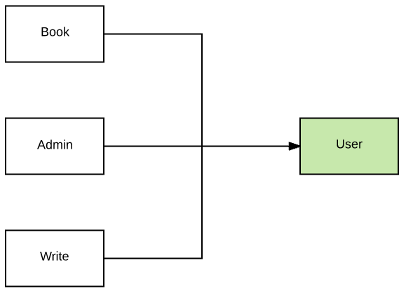

# book.com trang web xuất bản, bán sách ebook
Có một công ty bán sách trực tuyến cần xây dựng một web site để trình bày các sách ebook. Địa chỉ trang web là www.book.com

Công ty còn có phần back office với số lượng nhân viên là 40 người cùng với đội ngũ tác giả. Có nhiều nghiệp vụ cần quản lý trực tuyến ở địa chỉ admin.book.com

Một người bình thường vừa có thể đăng ký để mua sách (tải về bản ebook) vừa có thể tự xuất bản sách ở địa write.book.com

Người dùng không đăng ký thành viên sẽ chỉ được xem thông tin sách nhưng không được tải về.

Như vậy công ty có nhiều địa chỉ tên miền

1. https://www.book.com (dành cho mọi người user xem, tải sách, thư mục )
2. https://admin.book.com (dành cho admin để tạo category mới, xem danh sách các tác giả, thư mục admin)
3. https://write.book.com (dành cho tác giả viết sách riêng của mình, xem được bao nhiều truy cập và mua sách)

# Một số tính năng chính
Đây là hệ thống có nhiều web application sử dụng công nghệ khác nhau:
- www.book.com sử dụng Nunjucks dùng PostGresql. Đội mình làm
- admin.book.com sử dụng Nuxt dùng PostGresql. Đội mình làm
- write.book.com sử dụng React dùng MongoDB. Thuê đội khác phát triển

phần quản lý user cần tách riêng thành một microservice để dùng chung. Làm sao để người dùng chỉ cần đăng nhập 1 lần, trong vòng 30 phút, khi chuyển đến các web site book.com khác nhau không cần đăng nhập lại. Cái này gọi là Single Sign On.

Cần có một service chuyên quản lý tất cả các đầu sách và phân loại. Các service khác có thể sync dữ liệu về db của mình.

# TODO:

Vào trong thư mục gulp, sửa lại file gulpfile.js để nó tự động start tất cả các microservices trong thư mục:

- admin
- book
- user
- write

# Phân công

1. Đạt ở thư mục user, hãy viết user service lo việc authenticate. Tập trung xong sớm, khỏi bận tâm hỗ trợ fix bug các bạn khác. tốt
Khi họ có ví dụ tốt, document chi tiết, họ sẽ không tạo ra bug nữa.
    - getUserByID
    - findUserByText
    - ...
2. Linh ở thư mục book làm mấy việc: vừa render front end dùng NUXT hay Vue SSR vừa tạo ra REST API trả về book:
    - getBookByID làm sao join được thông tin từ Author
    - getAllBooks
    - downloadBookByID cần có token từ User
    

    